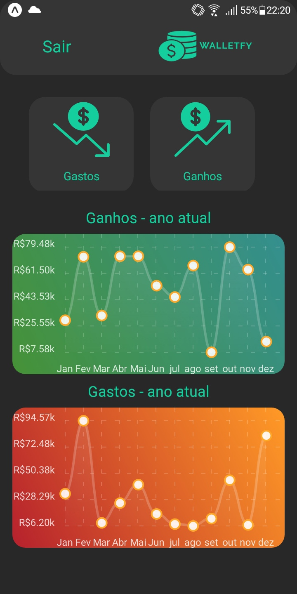

# 📃 Walletfy
---
<p align="center">
  <a href="#description">Description</a>&nbsp;&nbsp;&nbsp;|&nbsp;&nbsp;&nbsp;
  <a href="#Features">Features</a>&nbsp;&nbsp;&nbsp;|&nbsp;&nbsp;&nbsp;
  <a href="#how-to-use">How to Use</a>&nbsp;&nbsp;&nbsp;|&nbsp;&nbsp;&nbsp;
  <a href="#license">License</a>&nbsp;&nbsp;&nbsp;|&nbsp;&nbsp;&nbsp;
  <a href="#author-info">Author Info</a>
</p>

---




## Description
### Walletfy is a mobile app to manage earnings and expenses

## Technologies

- React Native
- Typescript
- Expo
- Firebase

# Features

- Create, update and delete earnings and expenses
- view data in charts
- Authentication flux using e-mail and password
- Sum of annual and monthly earnings and expenses

---
## ❗ How To Use

### Run locally

### Clone the project

```html
git clone https://github.com/GiovannaK/walletfy.git
```

### Assuming you already have Expo installed and properly configured: Run the command below to install all required dependencies

### Fill all information on .env.example and remove .example 

```html
npm install
```
### Finally you can run the project
```html
expo start
```

---

## 📌 License

MIT License

Copyright (c) [2020]

Permission is hereby granted, free of charge, to any person obtaining a copy
of this software and associated documentation files (the "Software"), to deal
in the Software without restriction, including without limitation the rights
to use, copy, modify, merge, publish, distribute, sublicense, and/or sell
copies of the Software, and to permit persons to whom the Software is
furnished to do so, subject to the following conditions:

The above copyright notice and this permission notice shall be included in all
copies or substantial portions of the Software.

THE SOFTWARE IS PROVIDED "AS IS", WITHOUT WARRANTY OF ANY KIND, EXPRESS OR
IMPLIED, INCLUDING BUT NOT LIMITED TO THE WARRANTIES OF MERCHANTABILITY,
FITNESS FOR A PARTICULAR PURPOSE AND NONINFRINGEMENT. IN NO EVENT SHALL THE
AUTHORS OR COPYRIGHT HOLDERS BE LIABLE FOR ANY CLAIM, DAMAGES OR OTHER
LIABILITY, WHETHER IN AN ACTION OF CONTRACT, TORT OR OTHERWISE, ARISING FROM,
OUT OF OR IN CONNECTION WITH THE SOFTWARE OR THE USE OR OTHER DEALINGS IN THE
SOFTWARE.

---

## Author Info

- Linkedin - [Giovanna Cunha](https://www.linkedin.com/in/giovanna-kelli/)
